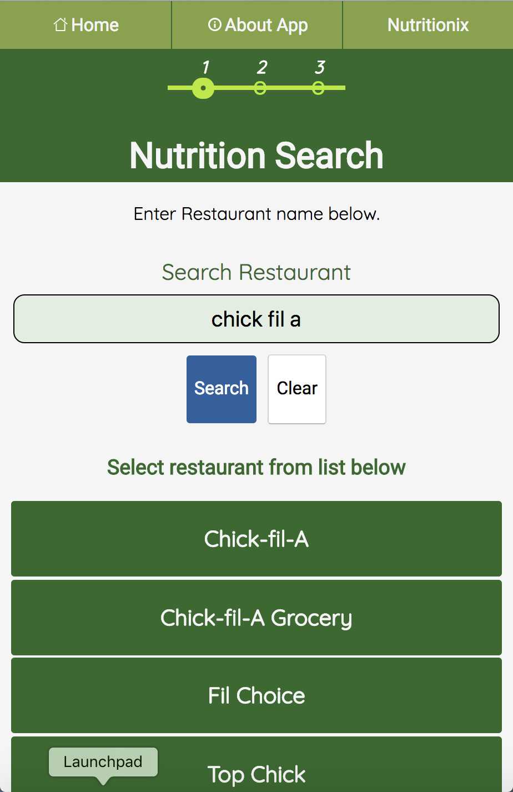
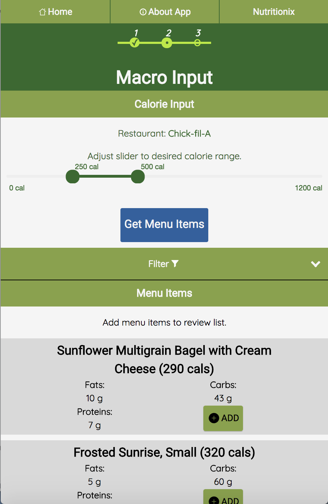
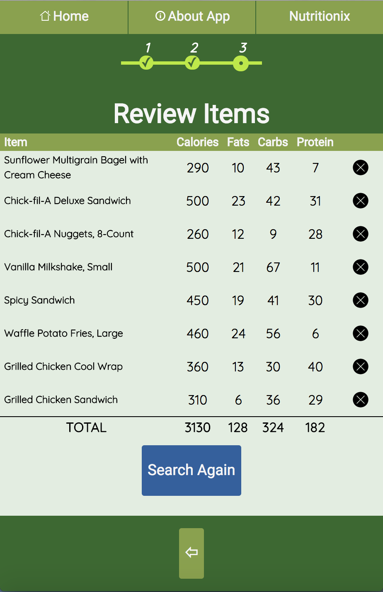

<h1>Nutrition Search</h1>

The application was developed for users who track macronutrients. It allows users to search for food items, based on restaurant, and create a running total of nutritional information.

<h5>Application:</h5> https://mactotal.netlify.com/

<h3>Screenshots</h3>
<h5>Restaurant Search</h5>

<h5>Calorie/Macro Range</h5>

<h5>Food Item Review</h5>

